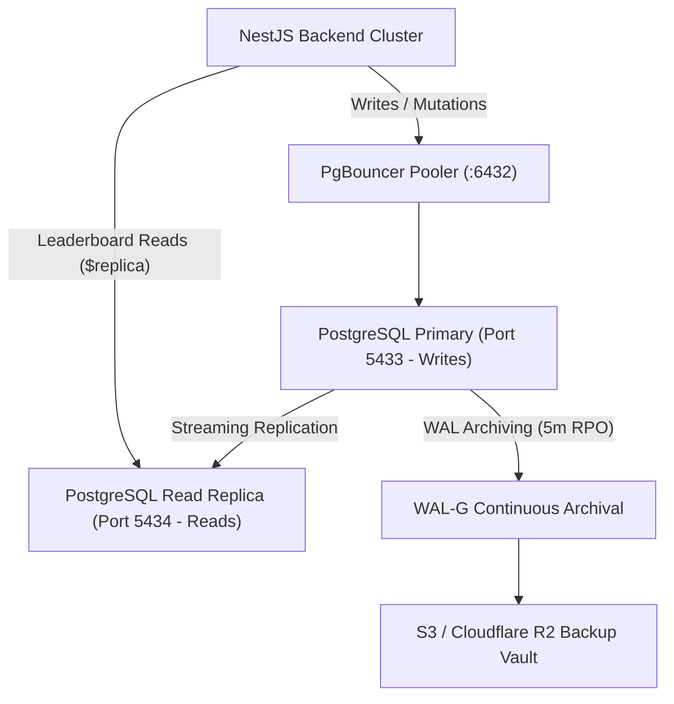

# PostgreSQL Disaster Recovery (DR), Read Replicas & Backup Runbook

## Overview & Recovery Objectives

OpenClubOS implements a dual-tier PostgreSQL architecture:
- **Primary Database**: PostgreSQL 15/16 (`Port 5433` local / `5432` internal) managing all write transactions.
- **Streaming Read Replica**: PostgreSQL 15/16 (`Port 5434` local / `5432` internal) offloading read-heavy leaderboard and public spectator queries via `@prisma/extension-read-replicas`.
- **Target RPO (Recovery Point Objective)**: ≤ 5 minutes (Continuous WAL Archiving).
- **Target RTO (Recovery Time Objective)**: ≤ 30 minutes (Automated Snapshot Restore & Promotion).

---

## 1. Replica Topology & Prisma Read Routing



### Prisma Read-Replica Configuration
In `apps/backend/src/common/prisma.service.ts`:
- All mutations (`create`, `update`, `delete`, `$transaction`) route to `DATABASE_URL` via PgBouncer.
- All high-frequency queries (`findMany`, `findUnique` on leaderboards) automatically hit `DATABASE_URL_REPLICA` using `@prisma/extension-read-replicas`.

---

## 2. Continuous WAL Archiving & Base Backups

1. **Daily Base Backups**: Scripted in [`scripts/db-backup.js`](file:///c:/Users/samue/Desktop/Openclubos/scripts/db-backup.js) producing compressed `.sql.gz` snapshots with SHA metadata.
2. **Point-In-Time-Recovery (PITR)**:
   - In AWS RDS: Multi-AZ automated backups with 5-minute continuous transaction log archiving.
   - In self-hosted setups: `wal-g backup-push /var/lib/postgresql/data` triggered on cron and WAL segment rotation.

---

## 3. Disaster Recovery Drill & Verification

Execute the automated monthly restore drill:
```bash
node scripts/db-restore-drill.js
```
**Verification Checks**:
1. Creates snapshot from primary.
2. Initializes isolated sandbox database on replica.
3. Streams and unpacks snapshot.
4. Asserts table schema integrity and row existence across all 16 database models.

---

## 4. Primary Failover Procedure

### Scenario A: Primary Node Crash in Production (Managed RDS / Aurora)
1. **Detection**: Health check alert triggers when `/api/health` reports PostgreSQL connectivity failure.
2. **Promotion**: RDS / Aurora automatically promotes the Multi-AZ replica to primary within 60–120 seconds.
3. **DNS Cutover**: CNAME resolves to the promoted instance automatically; Prisma connection pool reconnects with `idleTimeoutMillis: 30000`.

### Scenario B: Self-Hosted Failover (Patroni / Repmgr / Manual)
1. Promote read replica:
   ```bash
   docker exec openclub-postgres-replica pg_ctl promote -D /var/lib/postgresql/data
   ```
2. Update `DATABASE_URL` in `.env` / Kubernetes ConfigMap to point to the promoted instance.
3. Restart backend or trigger rollout:
   ```bash
   pnpm --filter backend build
   ```
